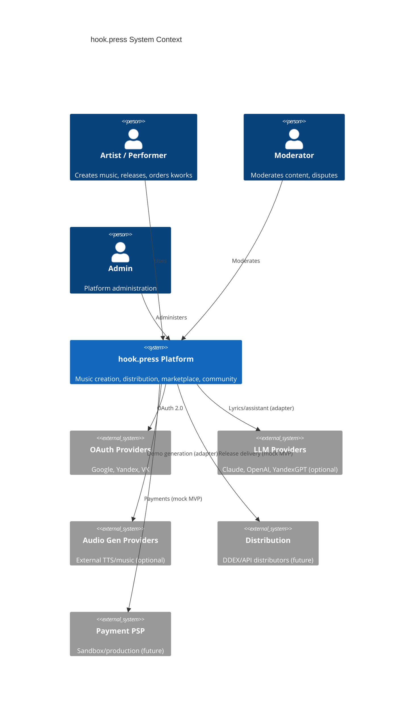
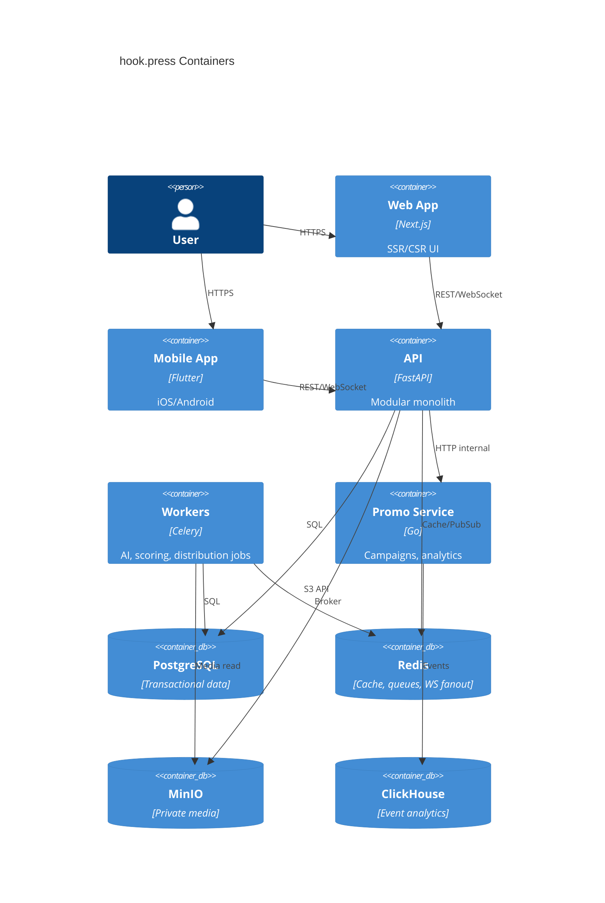
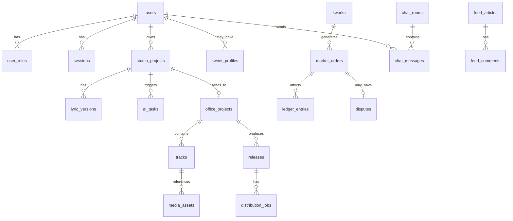

# hook.press — Architecture

## Version Matrix (MVP baseline)

| Component | Version | Notes |
|-----------|---------|-------|
| Node.js | 22 LTS | CI + Next.js build |
| pnpm | 9.x | Monorepo workspaces |
| Next.js | 15.1.x | App Router, React 19 |
| React | 19.x | Strict mode |
| TypeScript | 5.7.x | strict |
| Tailwind CSS | 3.4.x | Design tokens in `packages/ui` |
| Python | 3.12.x | Backend + Celery |
| FastAPI | 0.115.x | Async API |
| SQLAlchemy | 2.0.x | Async ORM |
| Alembic | 1.14.x | Migrations |
| Celery | 5.4.x | Background jobs |
| Redis | 7.2.x | Cache, Celery broker, Pub/Sub |
| PostgreSQL | 16.x | Primary datastore |
| MinIO | RELEASE.2024-12-18 | S3-compatible storage |
| Go | 1.23.x | Promo service |
| ClickHouse | 24.8 LTS | Promo analytics (Stage 8+) |
| Flutter | 3.27.x | iOS 16+, Android 10+ |
| Docker Compose | v2 | Local orchestration |
| OpenTelemetry | 1.x | Traces (Stage 10) |
| Prometheus | 2.55.x | Metrics |
| Grafana | 11.x | Dashboards |

Compatibility notes:
- Next.js 15 requires React 19; App Router only.
- SQLAlchemy 2.0 async requires `asyncpg` driver.
- Celery 5.4 supports Redis 7 as broker and result backend.
- MinIO SDK compatible with AWS S3 API v4 signatures.

## C4 — Context



## C4 — Containers



## Domain Boundaries (FastAPI modules)

| Module | Responsibility |
|--------|----------------|
| auth | OAuth, JWT, sessions, RBAC |
| users | Profiles, roles |
| studio | Lyrics, rhythm, rhymes, AI tasks |
| media | Upload, presigned URLs, scanning |
| office | Projects, tracks, releases |
| scoring | LibROSA heuristics (Celery) |
| distribution | Provider adapter, webhooks |
| market | Kworks, orders |
| billing | Ledger, escrow |
| disputes | Arbitration flow |
| chat | Community rooms, WS |
| media_feed | CMS, articles |
| charts | Hybrid chart pipeline |
| promotions | Bridge to Go promo API |
| notifications | Email/push/in-app |
| admin | Admin operations |
| audit | Immutable audit log |

## Layering (per module)

```
api/          → routers, request/response DTOs
application/  → use cases, orchestration
domain/       → entities, state machines, invariants
infrastructure/ → SQLAlchemy repos, S3, external adapters
```

## State Machines (backend-enforced)

See master prompt §23 — implemented in domain layer with transition guards + tests.

## ER Diagram (core entities)



## Provider Interfaces

| Interface | Mock default | Production adapter |
|-----------|--------------|-------------------|
| LLMProvider | MockLLM | Claude, OpenAI, YandexGPT |
| AudioProvider | MockAudio | External API |
| DistributionProvider | MockDistributor | DDEX/API |
| PaymentProvider | MockPayment | PSP sandbox |
| ChartSource | MockChart | Licensed APIs |
| OAuthProvider | DevLogin | Google, Yandex, VK |

## API Versioning

- Public REST: `/api/v1/...`
- OpenAPI: `/api/v1/openapi.json`
- Health: `/health`, `/ready`
- Correlation: `X-Request-ID` header propagated

## Security Summary

See `SECURITY.md` for threat model. Key points: private S3, RS256 JWT, refresh rotation, RBAC on every mutation, idempotent webhooks, no float money.

## Observability

Structured JSON logs, OTel traces (Stage 10), Prometheus metrics, Grafana dashboards, Sentry-compatible error hook.
